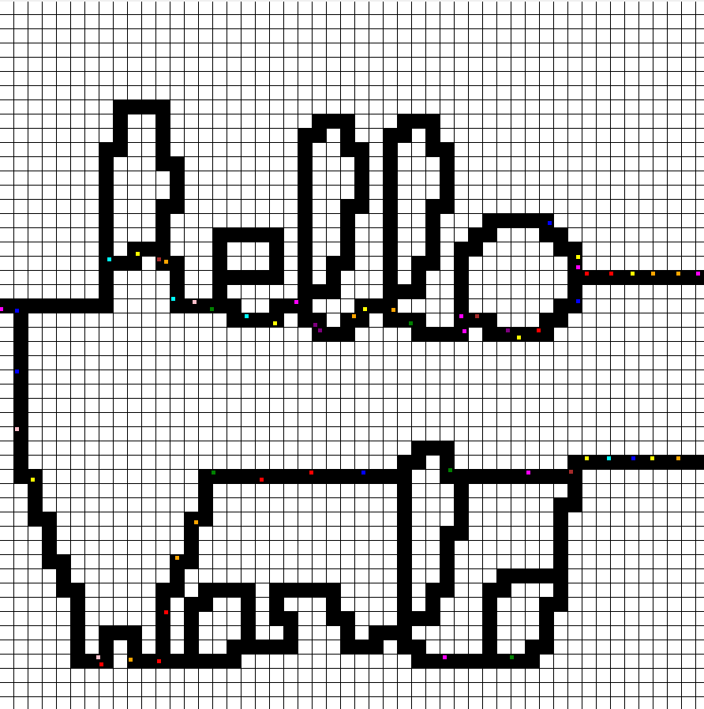
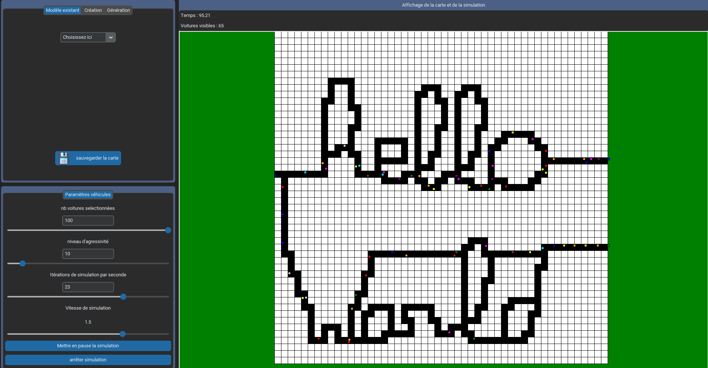

# Aggloméramax Pro

Aggloméramax Pro est un projet Python qui permet de créer des routes personnalisées, de les générer de manière procédurale, de les sauvegarder et de simuler la circulation de voitures dessus. Les voitures sont autonomes et peuvent donc générer des bouchons et d'autres situations de circulation réalistes.



[Vidéo de présentation](https://youtu.be/mMSLfY6sc9o)

[Vidéo du fonctionnement de l'algorithme non trivial](https://youtu.be/W0NBVyQGfx0) : La suite de tests mentionnée dans la vidéo qui assure la conformité des cartes est présente dans le dossier `\code\test\test_carte.py`

## Fonctionnalités

### Manipulation de cartes
#### Sérialisation et dé-sérialisation
- Sauvegarde de carte depuis le dossier "routes"
- Chargement de carte depuis le dossier "routes"
- Suppression de carte dans le dossier "routes"

#### Création
- Carte vierges de taille 10x10 à 50x50
- Curseur vert sur la grille si il est possible de poser une route, rouge sinon
- Clic gauche pour poser une route lorsque c'est possible
- Clic droit pour enlever une route
- Filtrage de la carte active pour faire respecter les règles de créations pour une carte utilisable en simulation :
    - Pas de bloc 2x2 de routes
    - Système de route connexe
    - Au moins 2 entrées/sorties (cases sur le bord)
    - Pas de cul-de-sac

#### Génération
- Génération procédurale de taille 10x10 à 50x50
- "Nombre de noeuds maximum à poser" influe sur le nombre d'intersections, mais n'est pas une garantie minimum ou maximum du nombre de noeuds final
- "Distance minimale entre les noeuds" est une garantie forte, la distance est à compter à partir du centre des intersections.
- La génération est garantie d'obéir à toutes les règles nécessaires à l'utilisation en simulation

### Simulation

#### Fonctionnalités de la simulation
- Simulation de la circulation de voitures autonomes
- Pas de collision réelle de voitures (les potentielles collisions observées visuellement notamment aux intersections sont dues à un compromis dans le développement de l'affichage)
- Gestion de différentes types de croisements de routes (noeuds): Virages, intersection T (à 3 voies) et intersections X (à 4 voies) gérés
- Accélération et freinage de chaque voiture contrôlés individuellement
- Recherche de plus court chemin exécutée à chaque progression de noeud, pondérée par la vitesse moyenne des voitures sur un trajet
- Gestion des embouteillages et d'autres situations de circulation

#### Simulation dans l'interface
- Possible de mettre en pause la simulation une fois lancée
    - Lorsque la simulation est en pause, appuyez sur la barre espace pour avancer d'une seule mise à jour de simulation
- L'arrêt complet de la simulation en cours permet de retourner sur l'éditeur de carte
- Cliquer sur une voiture affiche son chemin, ses obstacles ainsi que sa vitesse
- Choix du nombre de voitures maximum sur la route et de leur niveau d'agressivité moyen (avant ou pendant la simulation)
- Choix du nombre de mises à jour de simulation par seconde voulu (coûteux en calcul, la vitesse demandée ne peut pas forcément être garantie)
- Choix de la vitesse d'écoulement du temps dans la simulation (aucun impact sur la performance)

## Installation

Pour installer les dépendances requises, exécutez la commande suivante depuis la racine du projet.

```
pip install -r requirements.txt
```

Assurez-vous d'exécuter cette commande avant de lancer le projet pour garantir que toutes les dépendances sont correctement installées.

## Utilisation

Pour exécuter le projet, utilisez le script principal `main.py`.

```
python main.py
```

Interagissez directement avec la fenêtre pour dessiner, générer ou importer vos routes, puis lancez la simulation avec les paramètres souhaités pour observer la circulation des voitures autonomes.

## Captures d'écran


*Cette carte est intégrée dans le projet, vous pouvez l'utiliser*

## Licence

Ce projet est sous licence MIT. Veuillez consulter le fichier `LICENSE` pour plus de détails.
